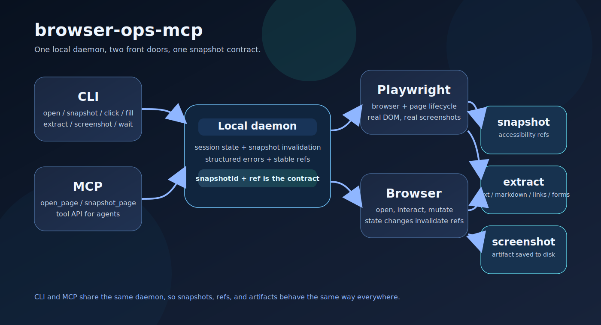

# browser-ops-mcp

`browser-ops-mcp` is a Playwright-powered CLI and MCP server for stable browser automation. It keeps a local daemon alive so agents can open a page, take a structured snapshot, interact through `snapshotId + ref`, extract content, and keep going without rebuilding state on every command.



## Why Now

- AI agents now spend a lot of time in browsers, but most browser automation still falls apart on selector drift and state loss.
- The MCP ecosystem has made it practical to expose the same capability to both humans and agents without duplicating logic.
- This repo leans into the part that is still painful in 2026: a stable snapshot contract that keeps interactions deterministic after page mutations.

## Live Examples

The repository includes reproducible sample outputs from the demo fixture:

- [`examples/demo-snapshot.json`](./examples/demo-snapshot.json)
- [`examples/demo-extract-text.json`](./examples/demo-extract-text.json)

## Design Choices

- `snapshotId + ref` is the primary interaction model, not free-form CSS selectors.
- CLI and MCP share the same daemon and action layer, so they cannot drift apart.
- Snapshot output is accessibility-first and intentionally small enough to inspect in a terminal.
- Mutating actions invalidate the previous snapshot immediately, which makes stale refs fail fast instead of silently acting on the wrong element.
- `extract` is intentionally narrow. It returns `text`, `markdown`, `links`, or `forms` instead of trying to be a general scraping engine.

## Comparison

| Approach | What it gets right | Where it breaks down |
| --- | --- | --- |
| Raw Playwright scripts | Full browser control | Every script invents its own state, selector, and retry model |
| Generic browser MCP wrappers | Easy agent integration | Often too loose about refs and page mutation |
| `browser-ops-mcp` | Shared daemon, snapshot contract, deterministic extract modes | It is intentionally narrow and local-first |

## Install

```bash
npm install
npm run build
npx playwright install chromium
```

Or install it globally after publishing:

```bash
npm install -g @aeewws/browser-ops-mcp
browser-ops --help
```

## Quickstart

Open a page:

```bash
browser-ops open https://example.com
```

Snapshot the current interactive elements:

```bash
browser-ops snapshot
```

Interact with a fresh reference:

```bash
browser-ops fill r1 "Ada Lovelace" --snapshot snap_123
browser-ops snapshot
browser-ops click r4 --snapshot snap_456
browser-ops wait --text "Submitted"
browser-ops extract --mode text
browser-ops screenshot --path ./browser-ops.png
browser-ops close
```

Run the MCP server:

```bash
browser-ops serve-mcp
```

## Commands

- `open <url>`: open a URL in the default session
- `snapshot`: emit a structured page snapshot with `sessionId`, `snapshotId`, `url`, `title`, and `elements[]`
- `click <ref> --snapshot <snapshotId>`: click an element from the latest snapshot
- `fill <ref> <text> --snapshot <snapshotId>`: fill an input or textarea
- `select <ref> <value> --snapshot <snapshotId>`: select an option in a `<select>`
- `wait`: wait for text, URL fragment, or a duration
- `extract`: extract `text`, `markdown`, `links`, or `forms`
- `screenshot`: save a PNG screenshot
- `close`: close the active browser session
- `serve-mcp`: run the MCP server over stdio

## MCP Tools

- `open_page`
- `snapshot_page`
- `click_element`
- `fill_element`
- `select_option`
- `wait_for`
- `extract_content`
- `take_screenshot`
- `close_session`

## Snapshot Contract

Every interaction is bound to a specific `snapshotId`. Once the page is mutated by `click`, `fill`, or `select`, the old snapshot becomes stale and the next command must use a new snapshot.

Each snapshot element includes:

```json
{
  "ref": "r1",
  "role": "button",
  "name": "Submit",
  "text": "Submit",
  "value": "",
  "disabled": false
}
```

## What It Is Not

- It is not a cloud browser farm.
- It is not a CAPTCHA solver.
- It is not a generic scraper or a full browser testing platform.
- It is not trying to replace Playwright itself.

## Development

```bash
npm install
npm run build
npm run typecheck
npm test
```

The smoke test opens [`tests/fixtures/demo.html`](./tests/fixtures/demo.html) with Playwright, fills a form, submits it, and verifies the extracted text.

## Limitations

- v1 is single-user and local-only
- It does not promise CAPTCHA solving
- Headed sessions are supported, but the daemon still assumes one active session ID at a time
- The current snapshot model is deliberately conservative; complex pages may need more targeted selectors or a follow-up snapshot.
